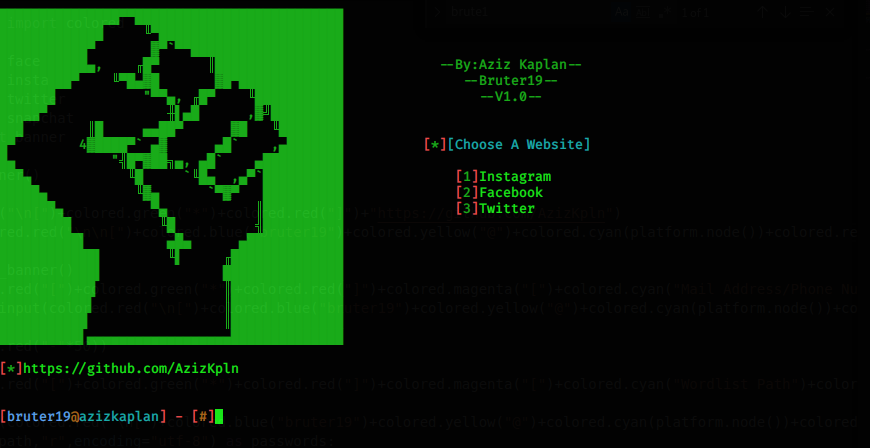
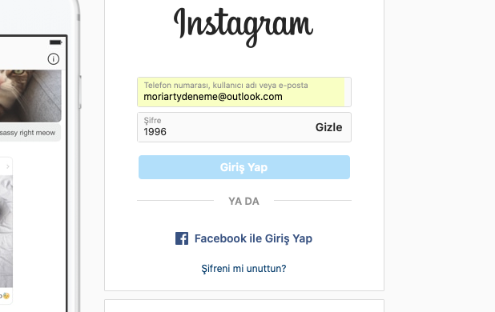
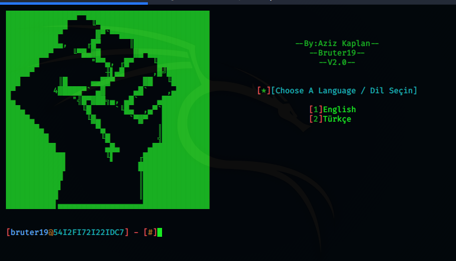
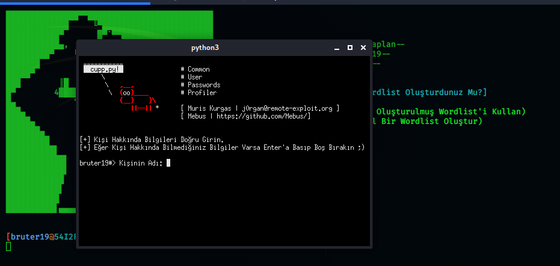

# DONATE BITCOIN
39NMXZtZGRndn6bUi5voV5drCDbrVvRimj
# Bruter19
* Advanced Brute Force Attack Tool.
* This tool has been developed for "ethical hacking course" students don't use it for illegal purposes.
# 
# INSTALLATION
* chmod +x setup.sh
* sudo ./setup.sh
* sudo python3 bruter19.py
# ADDED FEATURES IN V2.0
* The Tool Supports Turkish Language Now
* The Tool Is Able To Generate Personalized Wordlist Now
* The Tool Is A Bit Faster Now
# FIXED BUGS IN V2.0
* The tool was finding the wrong password in the long wordlists. It is fixed, the user is able to use long wordlists now.
* The tool was finding the wrong password every time you press ctrl+c. That issue is fixed now.
* The tool was failing when you inputed the wordlist path incorrectly. That issue is fixed now.
* Anonsurf was failing in the long wordlists. Now torghost is used in the tool. That issue is fixed now.
# CHROMEDRIVER 81 ERROR
* if you get this error,
* issue these commands;
* > sudo apt purge chromium
* > sudo apt install chromium
* then go to this link : https://chromedriver.chromium.org
* install chromedriver and copy it into Bruter19/path directory
# YOUTUBE VIDEO
* https://www.youtube.com/watch?v=5S1NdxuPgnA
# LOGIN ISSUES:
* Every password in the wordlist should be longer than 6 characters.
* if you have a password that is shorter than 6 characters, program may not work properly.
# 
* Instagram doesn't accept shorter than 6 character passwords. Therefore in this case, tool will not work properly.
# USAGE
* Choose Your Language
# 
* If You Input 2 after choosing the language, You Will Be Able To Generate Personalized Wordlist
# 
* Give The Mail 
* Give The Path Of The Wordlist

